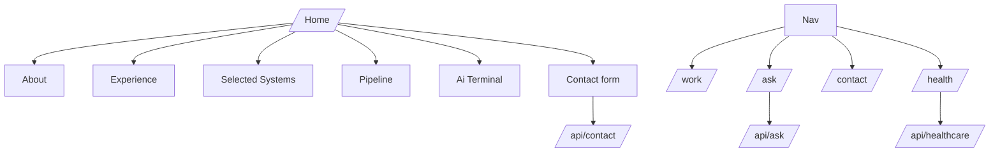

# Application Flow Diagram


```mermaid
flowchart TD
  Home[/ Home /] --> About[About]
  Home --> Experience[Experience]
  Home --> SelectedSystems[Selected Systems]
  Home --> Pipeline[Pipeline]
  Home --> AiTerminal[Ai Terminal]
  Home --> Contact[Contact form]
  Nav[Nav] --> Work[/work/]
  Nav --> Ask[/ask/]
  Nav --> ContactPage[/contact/]
  Nav --> Health[/health/]
  Ask --> ApiAsk[/api/ask/]
  Contact --> ApiContact[/api/contact/]
  Health --> ApiHealth[/api/healthcare/]
```
```<|end|><|start|>write to=assistant<|channel|>analysis<|message|>Created file successfully: docs/diagrams/application-flow.md